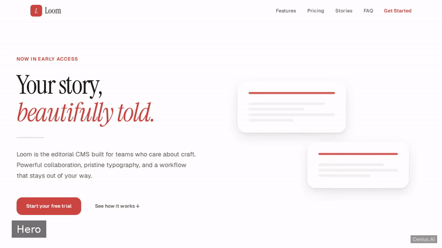
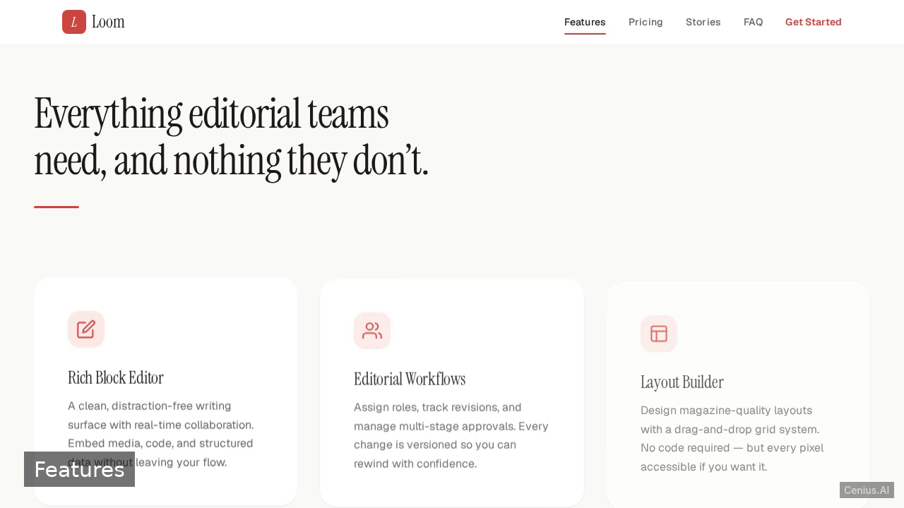
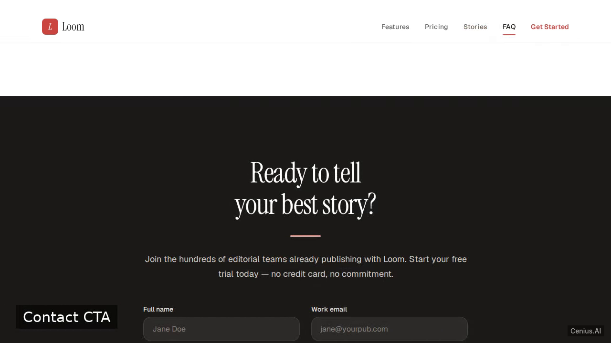
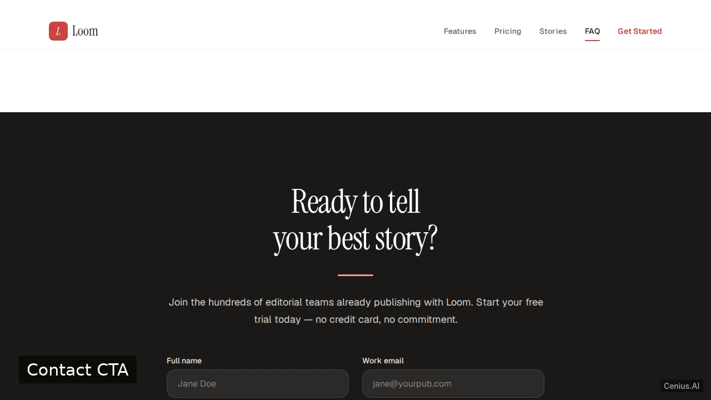

# SaaS Landing Page — production-ready Python landing page starter

**SaaS Landing Page** is a free, open-source landing page built with Python. Build a polished, single-page, static marketing landing site for a fictional SaaS product. Run it locally, deploy it as a self-hosted landing page, or [remix it on cenius.ai](https://cenius.ai/marketplace/p/saas-landing-page?ref=gh&utm_campaign=saas-landing-page-python) to make it your own — the whole application (code, design, seeded demo data) ships in this repository under the Apache-2.0 license.

  

> **▶ [Open & edit in cenius.ai](https://cenius.ai/marketplace/p/saas-landing-page?ref=gh&utm_campaign=saas-landing-page-python)** — one click to an editable workspace: describe changes in plain English, get an instant preview, one-click deploy and host. Modifications made on the platform come with full rebrand & relicense rights.

_Local clone? See [Quick start](#quick-start) below. cenius.ai is the zero-setup path._

## Demo

▶ **[Watch the full demo video](https://cenius.ai/marketplace/p/saas-landing-page?ref=gh&utm_campaign=saas-landing-page-python)** — the complete walkthrough, playing on the project's cenius.ai page · [MP4 file](.github/media/demo.mp4)

## Screenshots

  

## Quick start

See [`INSTALL.md`](INSTALL.md) for full setup and usage instructions.

## Usage guide

Open `index.html` in a web browser to view the landing page.

### Page Sections

The page is a single, scrollable surface containing the following sections:

- **Hero** – main headline and call-to-action
- **Features** – grid showcasing product capabilities
- **Pricing** – table of plans and prices
- **Testimonials** – customer quotes
- **FAQ** – frequently asked questions
- **Contact CTA** – final call-to-action encouraging visitor contact

Simply scroll down to explore each section. Interactive elements (if any) are controlled by `script.js` and styled via `styles.css`.

No backend or special actions are required.

_Full guide: [`USAGE.md`](USAGE.md)_

## Architecture

Python application, delivered as a complete, runnable project (19 files). Top-level layout: `assets/`. Setup details live in [`INSTALL.md`](INSTALL.md).

## FAQ

### How do I run SaaS Landing Page on my own server?

Everything you need ships in this repo: clone it, run `./install.sh` to install dependencies and seed demo data, then follow [`INSTALL.md`](INSTALL.md) to start it. No external services required.

### How do I make SaaS Landing Page my own brand?

Yes — and the easiest way is [remixing it on cenius.ai](https://cenius.ai/marketplace/p/saas-landing-page?ref=gh&utm_campaign=saas-landing-page-python): modifications made on the platform come with full rebrand and relicense rights over your derivative.

### Is there a no-code way to modify SaaS Landing Page?

Open it on [cenius.ai](https://cenius.ai/marketplace/p/saas-landing-page?ref=gh&utm_campaign=saas-landing-page-python) and describe the changes you want in plain English — the platform modifies the app and gives you a new, downloadable build.

### What is SaaS Landing Page built with?

SaaS Landing Page is a Python application — and this repository holds the complete, runnable source, not a stripped-down sample.

### Is SaaS Landing Page free for commercial use?

Yes — it ships under the Apache-2.0 license, which permits commercial use, modification and redistribution. The full text is in [LICENSE](LICENSE).

## License & rebranding

Released under the [Apache License 2.0](LICENSE) (© 2026 Cenius AI) — free for personal and commercial use. The Cenius name/logo are trademarks (see NOTICE).

**Need a customized version?** [Remix this app on cenius.ai](https://cenius.ai/marketplace/p/saas-landing-page?ref=gh&utm_campaign=saas-landing-page-python) — modifications made on the platform come with **full rebrand & relicense rights** over your derivative.

## Built with cenius.ai

This entire application — code, design, seeded demo data — was generated on **[cenius.ai](https://cenius.ai)** from a plain-English description.

- 🚀 [Build your own app on cenius.ai](https://cenius.ai)
- 🎛️ [Remix SaaS Landing Page on the marketplace](https://cenius.ai/marketplace/p/saas-landing-page?ref=gh&utm_campaign=saas-landing-page-python) — open it in a workspace, prompt for changes, and ship your own version.

More open-source apps: [the Cenius-ai catalog](https://github.com/Cenius-ai) · [showcase index](https://github.com/Cenius-ai/showcase)
